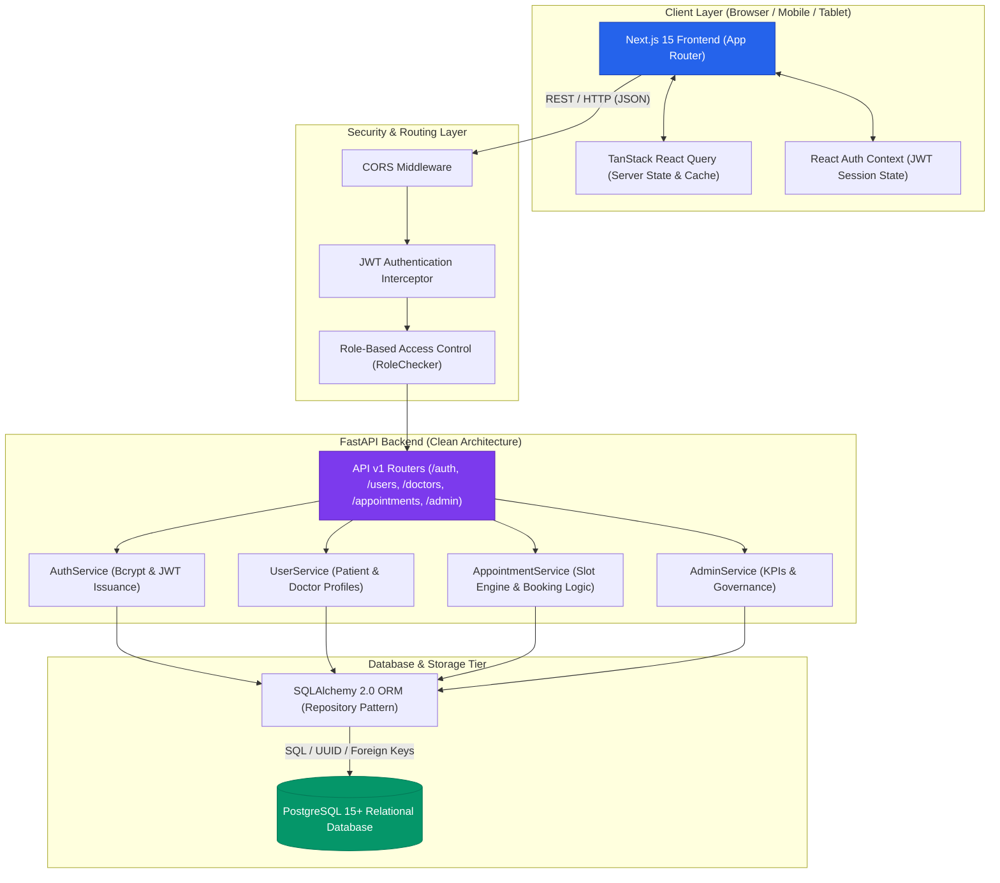
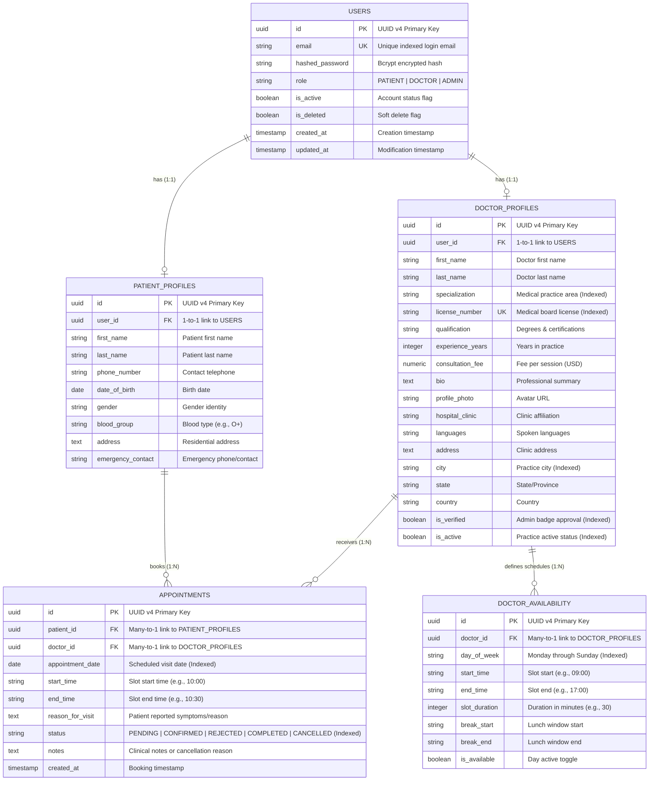
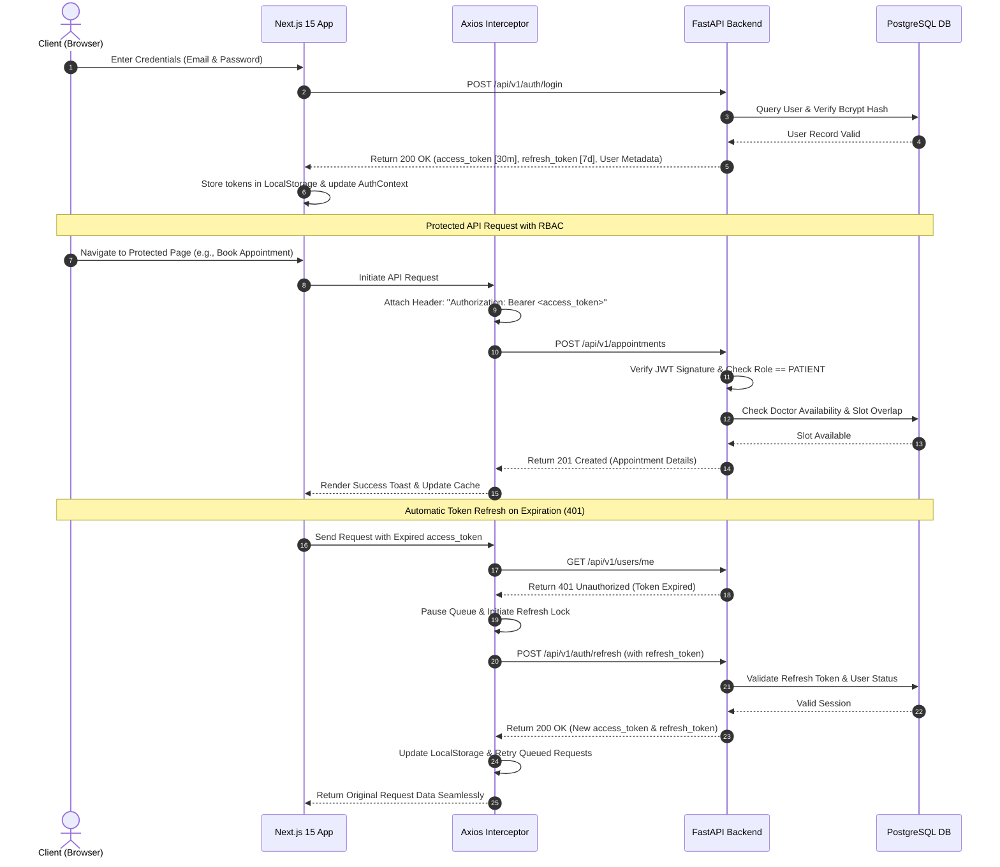
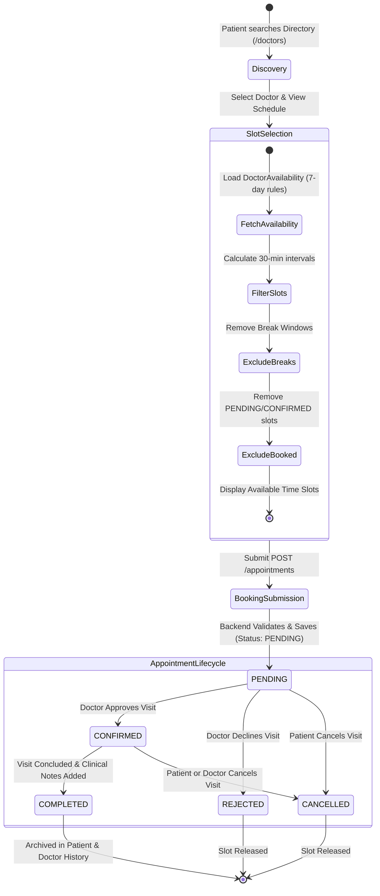
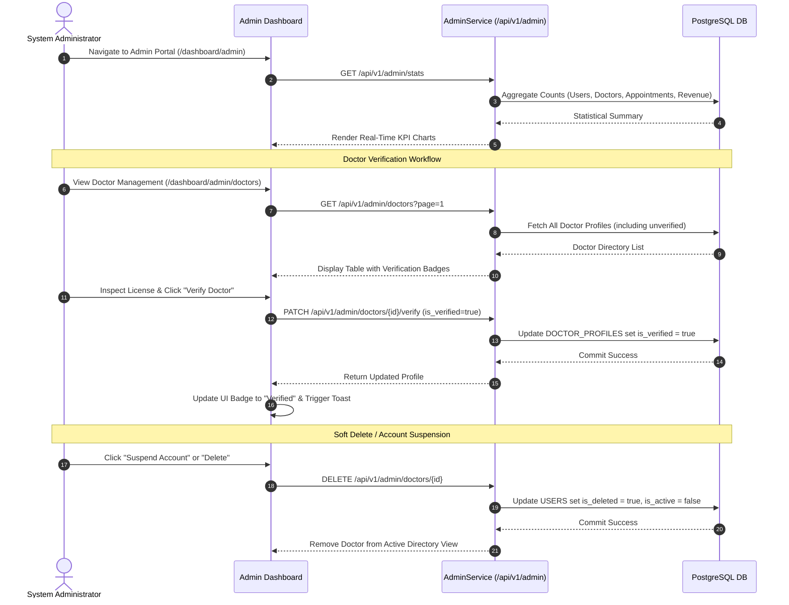

# MediCare Plus | System Architecture & Visual Diagrams

This document contains comprehensive **Mermaid.js** visual architecture diagrams, Entity-Relationship Diagrams (ERD), and end-to-end data flow charts for the **MediCare Plus Doctor Appointment System**.

---

## 1. System Architecture Diagram

The system follows a modern decoupled, cloud-native architecture utilizing **Clean Architecture** principles on the backend and an **Edge-Optimized App Router** architecture on the frontend.

---

## 2. Final Entity-Relationship Diagram (ERD)

The database schema is designed in 3rd Normal Form (3NF) with UUID v4 primary keys, strict foreign key cascading, and comprehensive database indexing on filterable columns.

---

## 3. Authentication & Authorization Flow

Illustrates stateless JWT authentication, Axios request/response interception, automatic token rotation via refresh tokens, and RBAC endpoint protection.

---

## 4. Patient Appointment Booking Workflow

Details the complete life-cycle of discovering a verified doctor, inspecting available slots, checking business logic constraints, and managing appointment statuses.

---

## 5. Admin Governance & Verification Flow

Shows how system administrators monitor platform metrics, review medical credentials, verify doctors, and enforce data governance.

